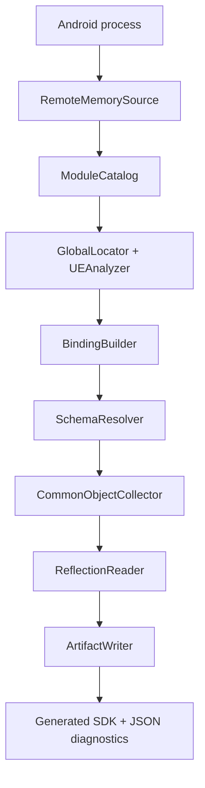

# AndUEFker

> A runtime Unreal Engine reflection and SDK generation tool for Android.

[](https://isocpp.org/)
[](https://cmake.org/)
[](https://developer.android.com/)
[](https://choosealicense.com/licenses/mit/)
[](https://github.com/Ezeny1337/AndUEFker/releases/)

[中文文档](README_zh.md)

AndUEFker discovers Unreal Engine runtime structures from a live Android process, validates the discovered object and name stores, resolves the engine reflection schema, and generates a compact C++ SDK together with machine-readable diagnostics.

Rather than relying on a single hardcoded layout, it combines binary analysis, runtime probing, cross-validation, and reflection data to establish verified runtime bindings prior to reading the object graph.

Build the tool with the ABI matching the target process: use the `arm64-v8a` binary for 64-bit games and the `armeabi-v7a` binary for 32-bit ARM games.

## Highlights

- **Runtime-first binding** — locates and validates `GUObjectArray`, `ObjObjects`, and `FName` storage at runtime.
- **Schema discovery** — resolves `UObject`, `UStruct`, `FField`/`FProperty`, `UFunction`, and `UEnum` layouts from live data.
- **ARM-aware analysis** — supports ARM64 and ARM32 ARM-mode decoding for Unreal Android binaries; Thumb/Thumb-2 analysis remains a separate follow-up.
- **Reflection extraction** — walks live Unreal objects and emits types, properties, functions, enums, inheritance, and layout metadata.
- **Common class addresses** — records useful `UClass` objects such as `World`, `Engine`, `GameInstance`, and `PlayerController`.
- **Reproducible artifacts** — writes generated headers, JSON metadata, diagnostics, and runtime binding details as one artifact directory.
- **Fail-closed validation** — invalid candidates and inconsistent layouts are rejected rather than silently treated as valid.

## Pipeline



The runtime session follows these stages:

1. Attach to the target process and discover the Unreal module.
2. Analyze the module and collect candidate object/name roots.
3. Validate object container and name store layouts.
4. Resolve the engine reflection schema from live objects.
5. Collect selected common `UClass` object addresses.
6. Read reflection data and generate the SDK artifact.

## Build

### Requirements

- Android SDK with platform `android-29` or compatible.
- Android NDK `25.2.9519653` for the repository CI configuration.
- CMake `3.22.1` for the repository CI configuration.
- Ninja.
- A host environment capable of building Android `arm64-v8a` and `armeabi-v7a` code.

### Configure and build

The following is the same toolchain shape used by the GitHub Actions workflow:

```bash
cmake -S . -B build/android-arm64-release -G Ninja \
  -DCMAKE_TOOLCHAIN_FILE="$ANDROID_NDK_HOME/build/cmake/android.toolchain.cmake" \
  -DANDROID_ABI=arm64-v8a \
  -DANDROID_PLATFORM=android-29 \
  -DCMAKE_BUILD_TYPE=Release

cmake --build build/android-arm64-release --parallel
```

The executable is produced at:

```text
build/android-arm64-release/AndUEFker
```

## Usage

```text
AndUEFker -o <output-dir> -p <package-name>
```

### Required options

| Option | Description |
| --- | --- |
| `-o`, `--output <dir>` | Writable directory for logs and the generated SDK artifact. |
| `-p`, `--package <name>` | Android package name of the target process. |

### Optional option

| Option | Description |
| --- | --- |
| `-h`, `--help` | Print command-line help. |

### Example

```bash
./AndUEFker \
  --output /storage/emulated/0/AndUEFker-output \
  --package com.example.game
```

## Generated artifact

If the package name is `com.example.game`, a successful run creates an artifact directory similar to:

```text
<output-dir>/com_example_game/
├── BasicTypes.hpp
├── Types.hpp
├── Enums.hpp
├── Functions.hpp
├── reflection.json
├── manifest.json
├── diagnostics.json
└── runtime.json
```

The output directory also receives the session log:

```text
<output-dir>/AndUEFker.log
```

### Generated files

| File | Purpose |
| --- | --- |
| `BasicTypes.hpp` | Generated SDK primitives and container helpers. |
| `Types.hpp` | Reflected Unreal classes and structs with forward declarations and layout information. |
| `Enums.hpp` | Reflected enum declarations and values. |
| `Functions.hpp` | Reflected function declarations and callable metadata. |
| `reflection.json` | Detailed reflection IR, including properties, functions, enums, inheritance, and addresses. |
| `manifest.json` | Artifact status and parsing statistics. |
| `diagnostics.json` | Reflection diagnostics, conflicts, and failure counters. |
| `runtime.json` | Runtime module, binding layout, schema offsets, and common object addresses. |

The generated headers use the `AndUE` namespace.

## Common object addresses

The runtime artifact can contain the following commonly used `UClass` objects:

```text
World
Engine
GameInstance
LocalPlayer
PlayerController
GameViewportClient
Console
CheatManager
```

These are class-object addresses discovered in the Unreal object store. They are not automatically the addresses of live instances such as the current `GWorld`, `GEngine`, or a current player controller instance.

## Validation and status

AndUEFker records evidence during binding and schema resolution, including:

- object and name candidate counts;
- selected container layouts and probe scores;
- resolved UObject and reflection offsets;
- object slot and reflection statistics;
- unknown properties, unresolved type details, layout conflicts, and read failures.

The generated `manifest.json` reports one of the following artifact states:

| State | Meaning |
| --- | --- |
| `Complete` | Reflection completed and all required output files were written. |
| `Partial` | Reflection completed with recoverable limitations; the artifact is marked `.partial`. |
| `Failed` | Binding, schema resolution, reflection, or artifact writing failed. |

The command-line process exits with `0` for a ready reflection result, `3` for a partial reflection result, and `1` for other failures or incomplete runtime stages.

## Issues

Please open an [issue](https://github.com/Ezeny1337/AndUEFker/issues) when you encounter a reproducible detection, binding, schema, reflection, or artifact-generation problem. Include:

1. The commit or release used.
2. Android version, device ABI, and target Unreal Engine information if known.
3. The command line with package names or sensitive values redacted where necessary.
4. The relevant `AndUEFker.log` section.
5. `manifest.json`, `diagnostics.json`, and `runtime.json` when available.
6. A concise reproduction description and the expected result.

Before uploading logs or artifacts, remove credentials, private binaries, proprietary assets, and any information that you are not authorized to share. Large generated `reflection.json` files can be attached separately or summarized with the relevant object and schema records.

## Disclaimer

AndUEFker is provided for authorized research, debugging, interoperability, and development purposes. You are responsible for obtaining permission to inspect the target process and for complying with applicable laws, licenses, platform rules, and software terms of service. Runtime layouts vary between engine versions, forks, build configurations, and shipping processes; successful binding does not guarantee that every generated field or function is complete or safe for production use. The project is provided without warranties, and the maintainers are not responsible for damage, data loss, service disruption, or misuse resulting from its use.

## License

    MIT License

    Copyright (c) 2026 Ezeny1337

    Permission is hereby granted, free of charge, to any person obtaining a copy
    of this software and associated documentation files (the "Software"), to deal
    in the Software without restriction, including without limitation the rights
    to use, copy, modify, merge, publish, distribute, sublicense, and/or sell
    copies of the Software, and to permit persons to whom the Software is
    furnished to do so, subject to the following conditions:

    The above copyright notice and this permission notice shall be included in all
    copies or substantial portions of the Software.

    THE SOFTWARE IS PROVIDED "AS IS", WITHOUT WARRANTY OF ANY KIND, EXPRESS OR
    IMPLIED, INCLUDING BUT NOT LIMITED TO THE WARRANTIES OF MERCHANTABILITY,
    FITNESS FOR A PARTICULAR PURPOSE AND NONINFRINGEMENT. IN NO EVENT SHALL THE
    AUTHORS OR COPYRIGHT HOLDERS BE LIABLE FOR ANY CLAIM, DAMAGES OR OTHER
    LIABILITY, WHETHER IN AN ACTION OF CONTRACT, TORT OR OTHERWISE, ARISING FROM,
    OUT OF OR IN CONNECTION WITH THE SOFTWARE OR THE USE OR OTHER DEALINGS IN THE
    SOFTWARE.
