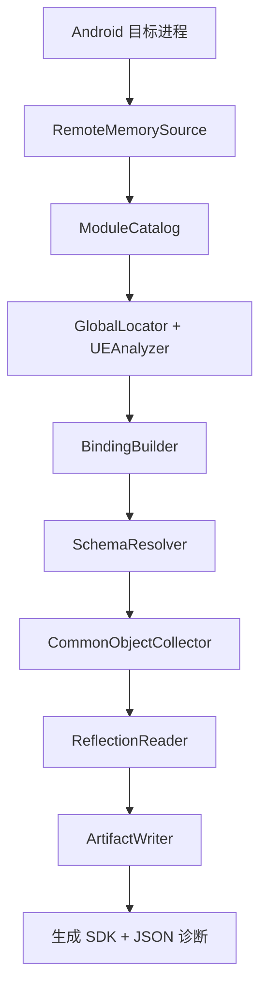

# AndUEFker

> 面向 Android 的 Unreal Engine 运行时反射与 SDK 生成工具。

[](https://isocpp.org/)
[](https://cmake.org/)
[](https://developer.android.com/)
[](https://choosealicense.com/licenses/mit/)
[](https://github.com/Ezeny1337/AndUEFker/releases/)

[English](README.md)

AndUEFker 可以从正在运行的 Android 进程中发现 Unreal Engine 的运行时结构，验证对象表与名称存储，解析引擎反射 Schema，并生成紧凑的 C++ SDK 以及机器可读的诊断信息。

它不依赖单一硬编码布局，而是结合二进制分析、运行时探针、交叉验证和反射数据，在读取对象图之前先建立经过验证的运行时绑定。

工具 ABI 需要与目标进程匹配：64 位游戏使用`arm64-v8a`版本，32 位 ARM 游戏使用`armeabi-v7a`版本。

## 核心能力

- **运行时绑定** — 运行时定位并验证 `GUObjectArray`、`ObjObjects` 与 `FName` 存储。
- **Schema 自动解析** — 从实时数据中解析 `UObject`、`UStruct`、`FField`/`FProperty`、`UFunction` 和 `UEnum` 布局。
- **ARM 架构分析** — 支持 ARM64 和 ARM32 ARM-mode 指令解码，以及面向 Unreal 二进制的候选地址分析策略。
- **反射提取** — 遍历 Unreal 运行时对象，输出类型、属性、函数、枚举、继承关系和布局元数据。
- **常用类地址收集** — 记录 `World`、`Engine`、`GameInstance`、`PlayerController` 等常用 `UClass` 对象地址。
- **完整产物输出** — 将生成头文件、JSON 元数据、诊断信息和运行时绑定信息写入统一产物目录。
- **验证失败即拒绝** — 对无效候选和不一致布局进行拒绝，避免静默使用错误结果。

## 工作流程



一次运行会依次执行以下阶段：

1. 连接目标进程并发现 Unreal 模块。
2. 分析模块，收集对象根和名称根候选地址。
3. 验证对象容器和名称存储布局。
4. 从运行时对象中解析引擎反射 Schema。
5. 收集选定的常用 `UClass` 对象地址。
6. 读取反射数据并生成 SDK 产物。

## 构建

### 环境要求

- Android SDK，包含 `android-29` 或兼容版本的平台组件。
- Android NDK `25.2.9519653`，与仓库 CI 配置一致。
- CMake `3.22.1`，与仓库 CI 配置一致。
- Ninja。
- 能够构建 Android `arm64-v8a` 和 `armeabi-v7a` 代码的主机环境。

### 配置与构建

下面的工具链配置与 GitHub Actions 工作流一致：

```bash
cmake -S . -B build/android-arm64-release -G Ninja \
  -DCMAKE_TOOLCHAIN_FILE="$ANDROID_NDK_HOME/build/cmake/android.toolchain.cmake" \
  -DANDROID_ABI=arm64-v8a \
  -DANDROID_PLATFORM=android-29 \
  -DCMAKE_BUILD_TYPE=Release

cmake --build build/android-arm64-release --parallel
```

可执行文件位于：

```text
build/android-arm64-release/AndUEFker
```

## 使用方法

```text
AndUEFker -o <输出目录> -p <包名>
```

### 必选参数

| 参数 | 说明 |
| --- | --- |
| `-o`、`--output <dir>` | 用于保存日志和生成 SDK 产物的可写目录。 |
| `-p`、`--package <name>` | 目标进程的 Android 包名。 |

### 可选参数

| 参数 | 说明 |
| --- | --- |
| `-h`、`--help` | 显示命令行帮助。 |

### 示例

```bash
./AndUEFker \
  --output /storage/emulated/0/AndUEFker-output \
  --package com.example.game
```

## 生成的 SDK 产物

例如包名为 `com.example.game` 时，成功运行后会生成类似目录：

```text
<输出目录>/com_example_game/
├── BasicTypes.hpp
├── Types.hpp
├── Enums.hpp
├── Functions.hpp
├── reflection.json
├── manifest.json
├── diagnostics.json
└── runtime.json
```

输出目录本身还会保存本次运行日志：

```text
<输出目录>/AndUEFker.log
```

### 文件说明

| 文件 | 用途 |
| --- | --- |
| `BasicTypes.hpp` | SDK 基础类型与容器辅助定义。 |
| `Types.hpp` | 生成的 Unreal 类和结构体，包含前置声明及布局信息。 |
| `Enums.hpp` | 生成的枚举声明和值。 |
| `Functions.hpp` | 生成的函数声明及调用元数据。 |
| `reflection.json` | 详细反射 IR，包括属性、函数、枚举、继承关系和地址。 |
| `manifest.json` | 产物状态和解析统计信息。 |
| `diagnostics.json` | 反射诊断、冲突和失败计数。 |
| `runtime.json` | 运行时模块、绑定布局、Schema 偏移和常用对象地址。 |

生成的头文件使用 `AndUE` 命名空间。

## 常用对象类地址

运行时产物可以包含以下常用 `UClass` 对象：

```text
World
Engine
GameInstance
LocalPlayer
PlayerController
GameViewportClient
Console
CheatManager
```

这些是从 Unreal 对象表中发现的类对象地址，并不自动等同于当前运行实例的地址，例如当前的 `GWorld`、`GEngine` 或当前玩家控制器实例地址。

## 验证与状态

AndUEFker 会在绑定和 Schema 解析阶段记录以下证据：

- 对象和名称候选数量；
- 选中的容器布局及探针评分；
- 解析出的 UObject 和反射偏移；
- 对象槽位和反射统计；
- 未知属性、未解析类型细节、布局冲突和读取失败。

生成的 `manifest.json` 会报告以下产物状态：

| 状态 | 含义 |
| --- | --- |
| `Complete` | 反射读取与 SDK 描述均完整，所有必需产物文件均已写入并关闭。 |
| `Partial` | 反射读取或 SDK 描述存在限制，产物目录会标记为 `.partial`。 |
| `Failed` | 绑定、Schema 解析、反射或产物写入失败。 |

命令行程序在完整产物就绪时返回 `0`，反射读取或 SDK 描述部分完成时返回 `3`，其他失败或未完成运行阶段返回 `1`。

`manifest.json` 分别记录 `reflection_status` 和 `sdk_status`。Opaque 容器表示字段类型已识别，但内部实现没有展开；它本身不会使 SDK 描述变为部分完成。遗漏字段和描述布局警告会使 SDK 描述标记为部分完成。采集一致性只覆盖实际观测并复核的字节，最多重试一次；`capture.atomic_snapshot` 始终为 `false`，不表示获得了活动进程的原子快照。

## Issue

遇到可复现的目标识别、绑定、Schema、反射或产物生成问题时，请提交 [Issue](https://github.com/Ezeny1337/AndUEFker/issues)。建议包含：

1. 使用的 commit 或 release。
2. Android 版本、设备 ABI，以及已知的目标 Unreal Engine 信息。
3. 执行命令；必要时请先隐藏包名或其他敏感值。
4. 相关的 `AndUEFker.log` 日志片段。
5. 可提供时附上 `manifest.json`、`diagnostics.json` 和 `runtime.json`。
6. 简洁的问题复现步骤和预期结果。

上传日志或产物前，请移除凭据、私有二进制、专有资源以及任何未经授权不得分享的信息。较大的 `reflection.json` 可以单独作为附件，或只提供相关对象和 Schema 记录。

## 免责声明

AndUEFker 仅面向获得授权的研究、调试、互操作和开发用途。使用者应自行确保拥有检查目标进程的合法授权，并遵守适用法律、许可证、平台规则和软件服务条款。不同引擎版本、分支、构建配置和 Shipping 进程之间的运行时布局可能存在差异；绑定成功不代表每个生成字段或函数都完整，也不代表生成代码适合直接用于生产环境。本项目按现状提供，不作任何明示或默示保证；因使用、误用或无法使用本项目造成的损坏、数据丢失、服务中断或其他后果，维护者不承担责任。

## 许可证

    MIT License

    Copyright (c) 2026 Ezeny1337

    Permission is hereby granted, free of charge, to any person obtaining a copy
    of this software and associated documentation files (the "Software"), to deal
    in the Software without restriction, including without limitation the rights
    to use, copy, modify, merge, publish, distribute, sublicense, and/or sell
    copies of the Software, and to permit persons to whom the Software is
    furnished to do so, subject to the following conditions:

    The above copyright notice and this permission notice shall be included in all
    copies or substantial portions of the Software.

    THE SOFTWARE IS PROVIDED "AS IS", WITHOUT WARRANTY OF ANY KIND, EXPRESS OR
    IMPLIED, INCLUDING BUT NOT LIMITED TO THE WARRANTIES OF MERCHANTABILITY,
    FITNESS FOR A PARTICULAR PURPOSE AND NONINFRINGEMENT. IN NO EVENT SHALL THE
    AUTHORS OR COPYRIGHT HOLDERS BE LIABLE FOR ANY CLAIM, DAMAGES OR OTHER
    LIABILITY, WHETHER IN AN ACTION OF CONTRACT, TORT OR OTHERWISE, ARISING FROM,
    OUT OF OR IN CONNECTION WITH THE SOFTWARE OR THE USE OR OTHER DEALINGS IN THE
    SOFTWARE.
